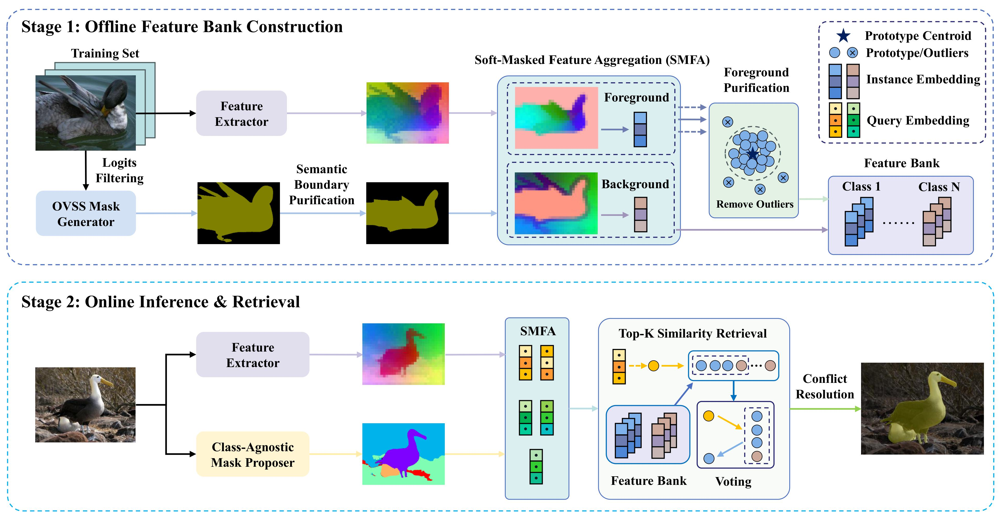

# ModuSeg: Decoupling Object Discovery and Semantic Retrieval for Training-Free Weakly Supervised Segmentation [](https://arxiv.org/abs/2604.07021)

We propose ModuSeg, a training-free weakly supervised semantic segmentation framework that explicitly decouples object discovery and semantic retrieval for high-quality pixel-level predictions.

## News

* **If you find this work helpful, please give us a :star2: to receive updates!**

## Overview

<p align="middle">

</p>

  Weakly supervised semantic segmentation aims to achieve pixel-level predictions using image-level labels. Existing methods typically entangle semantic recognition and object localization, which often leads models to focus exclusively on sparse discriminative regions. Although foundation models show immense potential, many approaches still follow the tightly coupled optimization paradigm, struggling to effectively alleviate pseudo-label noise and often relying on time-consuming multi-stage retraining or unstable end-to-end joint optimization. To address the above challenges, we present ModuSeg, a training-free weakly supervised semantic segmentation framework centered on explicitly decoupling object discovery and semantic assignment. Specifically, we integrate a general mask proposer to extract geometric proposals with reliable boundaries, while leveraging semantic foundation models to construct an offline feature bank, transforming segmentation into a non-parametric feature retrieval process. Furthermore, we propose semantic boundary purification and soft-masked feature aggregation strategies to effectively mitigate boundary ambiguity and quantization errors, thereby extracting high-quality category prototypes. Extensive experiments demonstrate that the proposed decoupled architecture  better preserves fine boundaries without parameter fine-tuning and achieves highly competitive performance on standard benchmark datasets.

## Table of Contents

- [1. Installation](#1-installation)
- [2. Compile EntitySeg Dependencies](#2-compile-entityseg-dependencies)
- [3. Download Pretrained Weights](#3-download-pretrained-weights)
- [4. Data Preparation](#4-data-preparation)
- [5. Run the Pipeline](#5-run-the-pipeline)
- [Main Results](#main-results)
- [Citation](#citation)
- [Acknowledgement](#acknowledgement)

---

## 1. Installation

> Please follow the steps in strict order, as there are dependencies between them.

```bash
# Clone this repository
git clone https://github.com/Autumnair007/ModuSeg.git
cd ModuSeg

# Create Conda environment (Python 3.10)
conda create -n CorrCLIP python=3.10
conda activate CorrCLIP

# Install PyTorch (2.1.2 / CUDA 12.1)
pip install torch==2.1.2 torchvision==0.16.2 torchaudio==2.1.2 --index-url https://download.pytorch.org/whl/cu121

# Install OpenMIM and MMSeg dependencies
pip install -U openmim
mim install mmengine==0.10.7
mim install mmcv==2.1.0

# Install MMSegmentation
pip install mmsegmentation==1.2.2

# Install remaining dependencies
pip install -r requirements.txt
```

---

## 2. Compile EntitySeg Dependencies

EntitySeg inference depends on Detectron2 and custom CUDA operators from Mask2Former, which must be compiled manually.

### 2.1 Install Detectron2

```bash
python -m pip install 'git+https://github.com/facebookresearch/detectron2.git'
```
Try the standard command first; use the version below if you encounter errors.

```bash
python -m pip install 'git+https://github.com/facebookresearch/detectron2.git' --no-build-isolation
```
### 2.2 Compile CropFormer EntityAPI

```bash
cd CropFormer/entity_api/PythonAPI
make
cd ../../..
```

### 2.3 Compile Mask2Former CUDA Operators

```bash
cd CropFormer/mask2former/modeling/pixel_decoder/ops
python setup.py build install
cd ../../../../../
```

After completing these three steps, `init_mask_proposer` in `src/inference.py` can load the EntitySeg model normally.

---

## 3. Download Pretrained Weights

Two pretrained weight files are required. Please download them and place them in the corresponding directories.

### 3.1 C-RADIOv4-SO400M Feature Extractor

Download `model.safetensors` from Hugging Face and place it in the `C_RADIOv4_SO400M/` directory:

```bash
# Option 1: Using huggingface-cli (recommended)
huggingface-cli download nvidia/C-RADIOv4-SO400M model.safetensors \
    --local-dir C_RADIOv4_SO400M/

# Option 2: Direct download
wget -P C_RADIOv4_SO400M/ \
    https://huggingface.co/nvidia/C-RADIOv4-SO400M/resolve/main/model.safetensors
```

> The model code files (`radio_model.py`, etc.) are already included in this repository. **Only the weight file** `model.safetensors` needs to be downloaded — no renaming required.

Final path:

```
C_RADIOv4_SO400M/
└── model.safetensors   ← download here
```

### 3.2 EntitySeg Mask2Former Weights

Download `Mask2Former_hornet_3x_576d0b.pth` from Hugging Face and place it in the `pretrain_model/` directory:

- Download page: <https://huggingface.co/datasets/qqlu1992/Adobe_EntitySeg/tree/main/CropFormer_model/Entity_Segmentation/Mask2Former_hornet_3x>

```bash
mkdir -p pretrain_model
wget -P pretrain_model/ \
    https://huggingface.co/datasets/qqlu1992/Adobe_EntitySeg/resolve/main/CropFormer_model/Entity_Segmentation/Mask2Former_hornet_3x/Mask2Former_hornet_3x_576d0b.pth
```

Final path:

```
pretrain_model/
└── Mask2Former_hornet_3x_576d0b.pth   ← download here
```

---

## 4. Data Preparation

### Final Directory Structure

```
data/
├── VOC2012/
│   ├── Annotations/                     # VOC2012 original annotations
│   ├── ImageSets/
│   │   ├── Segmentation/                # train.txt / val.txt standard splits
│   │   └── ImageLevel/                  # image-level weak labels
│   │       ├── train_imagelevel.json
│   │       └── val_imagelevel.json
│   ├── JPEGImages/                      # original images
│   ├── SegmentationClassAug/            # GT semantic masks (with SBD augmented set)
│   └── pseudo/
│       └── corrclip/                    # CorrCLIP pseudo-masks
│           ├── 2007_000032.png
│           └── ...
└── COCO2014/
    ├── images/
    │   ├── train2014/                   # COCO 2014 training images
    │   └── val2014/                     # COCO 2014 validation images
    ├── SegmentationClass/               # GT semantic masks (VOC style)
    │   ├── train2014/
    │   └── val2014/
    ├── ImageSets/
    │   ├── coco_train.txt               # list of training images with segmentation annotations
    │   └── coco_val.txt                 # list of validation images with segmentation annotations
    ├── annotations/
    │   ├── instances_train2014.json     # COCO original instance annotations
    │   ├── instances_val2014.json
    │   ├── train_imagelevel.json        # image-level weak labels
    │   └── val_imagelevel.json
    └── pseudo/
        └── corrclip/                    # CorrCLIP pseudo-masks
            └── train2014/
                ├── COCO_train2014_000000000009.png
                └── ...
```

### Option 1: Download from HuggingFace (Recommended)

Pre-processed segmentation labels, image-level labels, and CorrCLIP pseudo-masks are available at [QZing007/ModuSeg-Pseudo-Masks](https://huggingface.co/datasets/QZing007/ModuSeg-Pseudo-Masks).

```bash
huggingface-cli download QZing007/ModuSeg-Pseudo-Masks \
    --repo-type dataset \
    --local-dir data/
```

After downloading, extract the archives:

```bash
# VOC2012
cd data/VOC2012
unzip SegmentationClassAug.zip
unzip pseudo.zip

# COCO2014
cd ../COCO2014
unzip SegmentationClass.zip
unzip pseudo.zip
cd ../..
```

You still need to download the **original images** (not included in the HuggingFace repository):

**PASCAL VOC 2012 original images**:

```bash
wget http://host.robots.ox.ac.uk/pascal/VOC/voc2012/VOCtrainval_11-May-2012.tar
tar -xf VOCtrainval_11-May-2012.tar
cp -r VOCdevkit/VOC2012/JPEGImages                 data/VOC2012/
cp -r VOCdevkit/VOC2012/Annotations                data/VOC2012/
cp -r VOCdevkit/VOC2012/ImageSets/Segmentation     data/VOC2012/ImageSets/
```

**MSCOCO 2014 original images**:

```bash
wget http://images.cocodataset.org/zips/train2014.zip
wget http://images.cocodataset.org/zips/val2014.zip
unzip train2014.zip -d data/COCO2014/images/
unzip val2014.zip   -d data/COCO2014/images/

# COCO original instance annotations (only needed for generating image-level labels manually;
# can be skipped if using the HuggingFace dataset)
wget http://images.cocodataset.org/annotations/annotations_trainval2014.zip
unzip annotations_trainval2014.zip
cp annotations/instances_train2014.json data/COCO2014/annotations/
cp annotations/instances_val2014.json   data/COCO2014/annotations/
```

### Option 2: Generate Manually (Optional)

If you prefer not to use the HuggingFace pre-processed files, follow the steps below to generate them from scratch. This procedure references [ExCEL](https://github.com/zwyang6/ExCEL).

#### Step 1: Prepare SegmentationClass Annotations

**VOC2012**: `SegmentationClassAug` comes from the [SBD dataset](http://home.bharathh.info/pubs/codes/SBD/download.html). Download from [DropBox](https://www.dropbox.com/s/oeu149j8qtbs1x0/SegmentationClassAug.zip?dl=0) and extract to `data/VOC2012/`.

**COCO2014**: `SegmentationClass` can be generated using the [coco2voc script](https://github.com/alicranck/coco2voc), or downloaded from [Google Drive](https://drive.google.com/file/d/147kbmwiXUnd2dW9_j8L5L0qwFYHUcP9I/view) and extracted to `data/COCO2014/SegmentationClass/`.

#### Step 2: Generate Image-Level Labels

```bash
conda activate CorrCLIP

# VOC2012 (extracted from SegmentationClassAug masks)
python tools/generate_voc_imagelevel_train_val.py --voc-root data/VOC2012

# COCO2014 (first generate the image list with segmentation annotations, then extract labels)
python tools/generate_coco_split_from_segmentationclass.py --coco-root data/COCO2014
python tools/generate_coco_imagelevel_train_val.py --coco-root data/COCO2014
```

#### Step 3: Generate CorrCLIP Pseudo-Masks

```bash
# VOC2012
python tools/generate_pseudo_masks.py --dataset voc --split train

# COCO2014
python tools/generate_pseudo_masks.py --dataset coco --split train2014
```

Optional flag: `--no-resume` disables checkpoint resumption and regenerates all masks from scratch.

---

## 5. Run the Pipeline

After completing all the preparation steps above, use `tools/run_pipeline.py` to launch the full **feature bank construction + inference** pipeline in a tmux session with a single command.

### Usage

```bash
conda activate CorrCLIP

# VOC2012 (uses CUDA:1 by default)
python tools/run_pipeline.py voc

# COCO2014 (uses CUDA:2 by default)
python tools/run_pipeline.py coco

# Specify GPU device
python tools/run_pipeline.py voc --cuda 0
python tools/run_pipeline.py coco --cuda 3

# Kill existing session with the same name and restart
python tools/run_pipeline.py voc --kill-existing
```

### Monitor Running Status

```bash
# Attach to the tmux session
tmux attach -t moduseg_voc    # VOC
tmux attach -t moduseg_coco   # COCO

# Follow the log in real time
tail -f feature_bank/logs/run_<timestamp>.log

# List all sessions
tmux ls
```

---

## Main Results

Semantic segmentation performance on PASCAL VOC 2012 and MS COCO 2014.

| Dataset | Backbone | Val (mIoU) | Test (mIoU) |
| :--- | :--- | :---: | :---: |
| **PASCAL VOC 2012** | C-RADIOv4-SO400M | 86.3 | [86.6](http://host.robots.ox.ac.uk/anonymous/K5O9YE.html) 🔗 |
| **MS COCO 2014** | C-RADIOv4-SO400M | 56.7 | - |

---

## Citation

If you find our work useful for your research, please consider citing:

```bibtex
@article{he2026moduseg,
  title={ModuSeg: Decoupling object discovery and semantic retrieval for training-free weakly supervised segmentation},
  author={He, Qingze and Liu, Fagui and Zhang, Dengke and Wei, Qingmao and Tang, Quan},
  journal={arXiv preprint arXiv:2604.07021},
  year={2026}
}
```

If you have any questions, please feel free to open an issue or contact the author at 202230430064@mail.scut.edu.cn.

---

## Acknowledgement

This repo is built upon the following open-source works:

- [CorrCLIP](https://github.com/zdk258/CorrCLIP) — pseudo-mask generation
- [C-RADIOv4](https://huggingface.co/nvidia/C-RADIOv4-SO400M) — feature extraction backbone
- [EntitySeg / CropFormer](https://github.com/qqlu/Entity) — class-agnostic mask proposals
- [ExCEL](https://github.com/zwyang6/ExCEL) — data preparation pipeline reference
- [WeCLIP](https://github.com/zbf1991/WeCLIP) — foundational framework reference

Many thanks to their brilliant works!